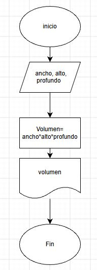
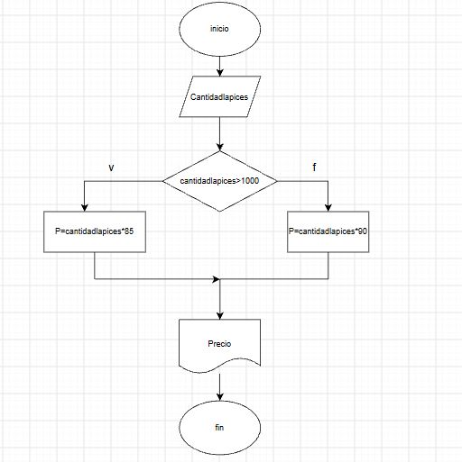
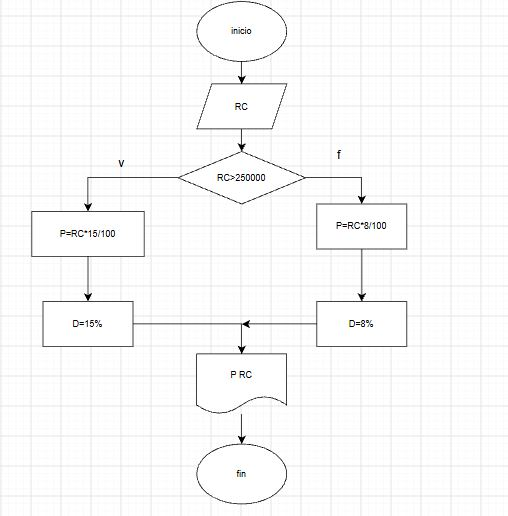

# **EJERCICIOS**

## *EJERCICIO DEL ACUARIO*
Un acuario necesita determinar cuántos litros de agua caben en un acuario, 
pero solo dispone de una cinta métrica (en centímetros). Diseña un algoritmo 
para solucionar el problema.

inicio
leer Ancho, Alto, Profundo
Volumenenlitros= Anchoxaltoxprofundo/1000
Mostrar "caben "Volumenenlitros"litros de agua en el acuario"
fin 

## *EJERCICIO LAPICES*
Realice un algoritmo para determinar cuánto se debe pagar por equis cantidad de lápices
considerando que si son 1000 o más el costo es de $85 cada uno;
de lo contrario, el precio es de $90. 
Represéntelo con el pseudocódigo y el diagrama de flujo.

Inicio
leer cantidadlapices
si cantidadlapices>1000
precio = cantidadlapices* 85
si no 
precio = cantidadlapices* 90
mostrar ""Precio"$"
Fin

## *EJERCICIO TIENDA DE ROPA*
Un almacén de ropa tiene una promoción: por compras superiores a $250 000
se les aplicará un descuento de 15%, de caso contrario, sólo se aplicará un 8% de descuento.
Realice un algoritmo para determinar el precio final que debe pagar una persona
por comprar en dicho almacén y de cuánto es el descuento que obtendrá. 
Represéntelo mediante el pseudocódigo y el diagrama de flujo.

Inicio
leer ropacomprada
si ropacomprada>250000
p=ropacomprada* 15/100
D=15%
si no
p= ropacomprada* 8/100
D=8%
Mostrar "el precio a pagar es de "p"$ y el descuento aplicado fue de D"
Fin

El director de una escuela está organizando un viaje de estudios,
y requiere determinar cuánto debe cobrar a cada alumno y cuánto debe pagar 
a la compañía de viajes por el servicio. 
La forma de cobrar es la siguiente:
si son 100 alumnos o más,el costo por cada alumno es de $65.00;
de 50 a 99 alumnos, el costo es de $70.00, 
de 30 a 49, de $95.00, 
y si son menos de 30, el costo de la renta del autobús es de $4000.00, 
sin importar el número de alumnos.

Inicio
Leer NE
Si NE >= 100
CA=65
VP=65* NE
SI NO
SI NE >=50 
CA=70
VP=CA* NE
SI NO
SI NE>=30
CA=95
VP=CA* NE
SI NO
VP=4000
CA=VP/NE
MOSTRAR: "EL VALOR DE CADA ALUMNO ES "CA" Y EL VALOR A PAGAR A LA EMPRESA ES "VP"
FIN

