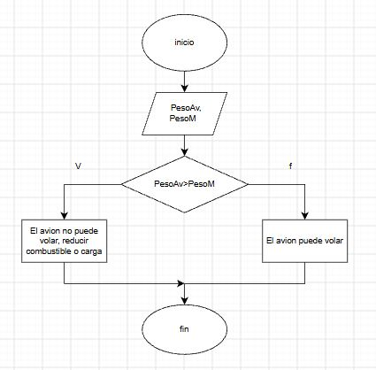
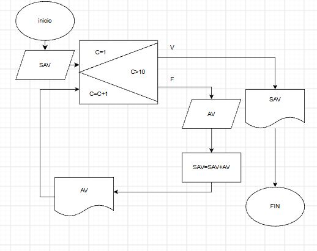
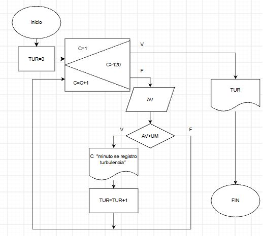

En una pista de pruebas de aeronaves, el sistema
debe verificar si el peso total de la aeronave, incluyendo
combustible y carga, supera el límite máximo permitido para el despegue. 
Dependiendo del resultado, el sistema deberá indicar si la aeronave está lista para 
despegar o si debe reducir carga o combustible.

Un sistema debe registrar la altitud de vuelo cada 10 minutos
durante una hora y mostrar todas las mediciones al final.

Un sensor mide la aceleración vertical de la aeronave en intervalos de un segundo
durante un trayecto de 2 minutos. Si el valor medido supera un umbral, indicar 
que se ha detectado turbulencia en ese instante. Al final, mostrar cuántas 
turbulencias se detectaron.

