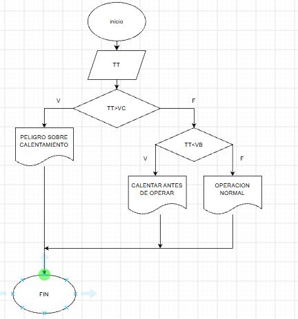
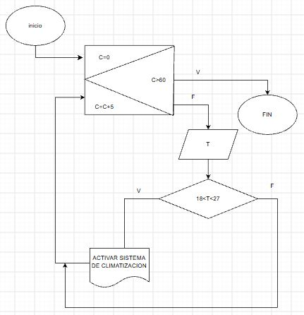
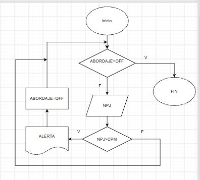

En una pista de pruebas de aeronaves, el sistema
debe verificar si el peso total de la aeronave, incluyendo
combustible y carga, supera el límite máximo permitido para el despegue. 
Dependiendo del resultado, el sistema deberá indicar si la aeronave está lista para 
despegar o si debe reducir carga o combustible.

Durante una inspección de rutina, se mide la temperatura de un motor de turbina.
Si la temperatura es mayor a un valor crítico, se debe indicar 
"Peligro: sobrecalentamiento". Si está dentro del rango seguro, indicar "Operación normal". 
Si es demasiado baja, indicar "Motor frío – Calentar antes de operar".

Un sistema debe registrar la altitud de vuelo cada 10 minutos
durante una hora y mostrar todas las mediciones al final.

Durante un ensayo en banco de un motor a reacción, se mide el nivel de combustible cada minuto
y se detiene el registro cuando el combustible baja del 10%. Mostrar el tiempo total de operación
antes de llegar a ese punto.

[Diagrama de flujo combustible](./imagenesrepo2/ddfttpc.JPG)

Un sensor mide la aceleración vertical de la aeronave en intervalos de un segundo
durante un trayecto de 2 minutos. Si el valor medido supera un umbral, indicar 
que se ha detectado turbulencia en ese instante. Al final, mostrar cuántas 
turbulencias se detectaron.

Un sistema mide cada 5 minutos la temperatura en cabina durante una hora.
Si en algún momento se detecta una temperatura mayor a 27°C o menor a 18°C, 
debe indicar que se active el sistema de climatización.

Durante el abordaje, un sistema cuenta a los pasajeros que ingresan.
Si el número total supera la capacidad máxima, 
el sistema debe detener el conteo y mostrar un mensaje de alerta.

